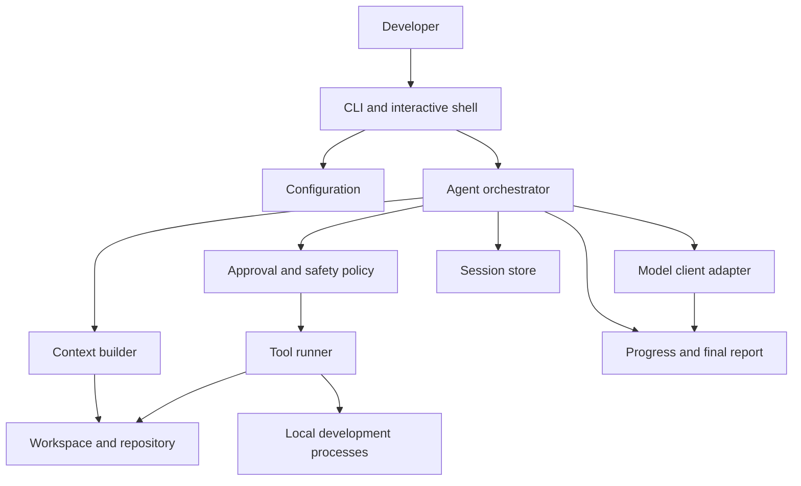

# Project Design

**Status:** Proposed

This document translates the goals in [purpose.md](purpose.md) into an initial technical design for `doit`. It describes the target product and architecture; it is not a claim that every component has already been implemented.

## 1. Product Vision

`doit` is a command-line workspace assistant for software development. It combines an AI model with repository context and controlled development tools so a user can ask for work, inspect the proposed actions, approve changes, and review the results from one interface.

The tool must remain useful in two modes:

- **Command mode:** Run a focused development, review, or testing task and exit with a useful result and status code.
- **Agent mode:** Start an interactive shell in which the user and the agent work through several related steps while sharing session context.

The user remains responsible for the workspace. `doit agent` asks before confirmation-required actions; `doit run` is an explicit automation mode that may perform local workspace changes through allowlisted tools while keeping network, path-escape, and remote operations blocked.

## 2. Design Goals

The design follows the goals in [purpose.md](purpose.md):

- Make common development, code review, and testing workflows accessible from the CLI.
- Use repository-local context so responses are grounded in the workspace being changed.
- Integrate with existing tools instead of replacing the user's compiler, test runner, formatter, or version-control workflow.
- Keep model providers behind an adapter so the rest of the application does not depend on one vendor or protocol.
- Make actions observable, interruptible, and recoverable when a model, tool, or process fails.
- Treat workspace contents, command execution, credentials, and model output as security-sensitive inputs.
- Keep the first implementation small enough to test thoroughly and extend without a plugin system prematurely.

## 3. Non-Goals for the Initial Release

The first release does not need to:

- Autonomously modify a repository without user visibility or approval.
- Support APIs that do not expose the OpenAI Responses compatibility contract; native provider-specific APIs can be added later.
- Replace a full IDE, CI system, issue tracker, or code-hosting platform.
- Execute arbitrary remote actions or manage production infrastructure.
- Preserve unlimited conversation history or send an entire repository to a model.

These boundaries keep the initial product focused on local, developer-controlled workflows.

## 4. Target Architecture

The application should be organized around an orchestration loop. The CLI owns interaction and process lifecycle; the agent orchestrator owns task progression; adapters isolate external systems.



### 4.1 CLI and Interactive Shell

Responsibilities:

- Parse commands, flags, and input streams.
- Load configuration and identify the working directory.
- Present model output, tool requests, approval prompts, errors, and final summaries.
- Return meaningful exit codes for scripting and automation.
- Support cancellation through the process context.

The shell should use a small command surface. Task-specific behavior belongs in the application and agent layers rather than in command parsing code.

#### Command Shape

The public CLI follows the Git convention of a stable command-first interface:

```text
doit [global options] <command> [command options] [arguments]
```

Commands are task-oriented rather than version-control operations. They should be lowercase, predictable, and composable from a terminal or script. Global options are accepted before the command; command options are accepted after it. `--` ends option parsing and separates a request or command arguments from pathspecs and pass-through values.

The initial command surface is:

| Command | Purpose | Example |
| --- | --- | --- |
| `doit` | Start an interactive agent session. This is the default when no command is supplied in a terminal. | `doit` |
| `doit agent` | Start or resume an interactive agent session explicitly. | `doit agent --resume <session>` |
| `doit run` | Execute one general-purpose request and exit. Read the request from arguments or stdin. | `doit run -- "explain the current build failure"` |
| `doit develop` | Plan and perform an approved development task within selected paths. | `doit develop "add retry handling" -- internal/model` |
| `doit review` | Review a commit range, working tree, or selected paths and report findings. | `doit review HEAD~1..HEAD -- .` |
| `doit test` | Run or diagnose the repository's tests and report validation results. | `doit test ./...` |
| `doit status` | Show the workspace, active session, backend profile, and pending task state without changing files. | `doit status` |
| `doit model test` | Check backend connectivity and report the configured model's compatibility capabilities. | `doit model test local` |
| `doit config` | Inspect or change user and project configuration, including named backend profiles. | `doit config list` |
| `doit session` | List, inspect, resume, or export local sessions. | `doit session list` |
| `doit doctor` | Run local diagnostics for configuration, credentials, workspace access, and required tools. | `doit doctor` |
| `doit version` | Print the CLI version and build information. | `doit version` |

`doit run` is the escape hatch for a request that does not fit a named workflow. The workflow commands provide stronger defaults and structured reports; they do not create separate model integrations.

The following global options are reserved for consistent behavior across commands:

- `-C, --directory <path>`: Use a different workspace directory.
- `-p, --profile <name>`: Select a named backend profile.
- `-m, --model <id>`: Override the configured opaque model identifier for this invocation.
- `--format <human|json>`: Select terminal output or a stable machine-readable result format.
- `--no-color`: Disable ANSI styling.
- `--quiet` and `--verbose`: Adjust progress and diagnostic detail.
- `--timeout <duration>`: Set a caller-controlled hard deadline for the request; the model may choose shorter per-process deadlines, but cannot extend this limit.
- `--ephemeral`: Do not write durable session data; the session can run but cannot be resumed after exit.
- `-h, --help` and `--version`: Show help or version information.

The CLI should not expose a global `--yes` shortcut that silently bypasses safety policy. Approval-required actions must be confirmed interactively or enabled through an explicit approval policy. In a non-interactive environment, an action that requires approval is denied unless the selected policy permits it.

#### Command Conventions

- A request may be supplied as one argument, several positional arguments joined with spaces, or stdin when stdin is not a terminal and no request argument is present.
- `doit review` accepts a Git-like revision range and optional pathspecs after `--`; path selection limits context and review scope but does not change repository history.
- `doit develop` and `doit review` must show the selected workspace and paths before an action that can modify or report on them.
- `doit test` delegates execution to configured repository commands; it does not replace the native test runner.
- Human-readable output is the default. `--format json` must write one documented result object suitable for scripts, while diagnostics remain on stderr.
- Interactive progress is emitted only when the output stream is a terminal unless `--verbose` is requested.
- All commands must support `--help`, and invalid command or option combinations must fail before contacting a model backend.

#### Exit Status

Exit codes are stable across commands:

- `0`: The command completed successfully and required validation passed.
- `1`: The task, tool, or required validation failed.
- `2`: Usage, argument, or local configuration error.
- `3`: Backend authentication, connectivity, model, or compatibility error.
- `4`: The user cancelled the task or an approval-required action was denied.

The exit status describes the command outcome, not whether the model produced useful text. A response that explains a failed test still returns `1` when the command's required validation failed.

### 4.2 Agent Orchestrator

The orchestrator coordinates a single task or an interactive session:

1. Accept the user's request and establish task limits.
2. Ask the context builder for the smallest useful set of repository information.
3. Send a structured request to the model client.
4. Render the model's response and identify any requested tool calls.
5. Evaluate each tool call through the approval and safety policy.
6. Execute approved tools and return bounded results to the model.
7. Repeat until the model reaches a final response, the user cancels, or a limit is reached.
8. Produce a final summary containing actions, changed files, validation results, and unresolved issues.

The safe local MVP uses a default maximum of 32 model/tool rounds. A task that reaches the limit fails with its accumulated usage and session evidence rather than continuing indefinitely.

The orchestrator should not know provider-specific request formats or shell-specific rendering details.

### 4.3 Context Builder

The context builder creates bounded, relevant input for the model. It may combine:

- The user's request and session history.
- Repository instructions and skills from the supported `.github`, `AGENTS.md`, `.agents/skills`, and `.doit` guidance locations.
- Repository status and relevant file paths.
- Focused file contents and nearby implementation context.
- Existing documentation and project instructions.
- Results from approved inspection or validation tools.

Context selection should be explicit and inspectable. The builder must avoid sending secrets, unnecessarily large files, ignored artifacts, or unrelated repository content. It must enforce an input-token budget before a request is sent.

When session history is trimmed to fit the input budget, function-call and function-call-output items must be removed as an atomic pair. Resumed history must discard orphaned or incomplete tool items before a provider request so the Responses API never receives a function output without its matching call.

Repository guidance discovery is an explicit allowlist. It reads `.github/copilot-instructions.md`, `AGENTS.md`, `.github/instructions/*.instructions.md`, `.github/skills/*/SKILL.md`, `.agents/skills/*/SKILL.md`, `.doit/instructions.md`, `.doit/instructions/*.md`, and `.doit/skills/*/SKILL.md`. Guidance is sorted, individually bounded, and capped in aggregate. Other `.doit` contents, including sessions and configuration, remain excluded unless a user explicitly requests them through a separate tool.

### 4.4 Model Client Adapter

The model layer exposes a provider-neutral interface to the orchestrator. The first adapter should be a direct HTTP adapter for backends that implement the OpenAI Responses API contract. The hosting location and provider name are configuration data, not compile-time dependencies.

The design is based on the [OpenAI API overview](https://developers.openai.com/api/reference/overview) and the [Responses create reference](https://developers.openai.com/api/reference/resources/responses/methods/create). `doit` uses the Responses API as its canonical model surface. It does not require the Realtime or Administration APIs.

#### OpenAI-Compatible Backend Contract

An OpenAI-compatible backend is any HTTP(S) service that satisfies the following contract at a configured API root:

- Accept `POST {api_root}/responses` with a JSON request body and a configured opaque `model` identifier.
- Accept text `input` and optional `instructions` values, including a client-managed sequence of prior turns.
- Return a JSON response with `object: "response"`, a completion `status`, and an `output` array.
- Return assistant text as an output item with `type: "message"` containing `content` items with `type: "output_text"`.
- Support client-defined function tools. The request must accept `tools` entries with `type: "function"`, `name`, and a JSON Schema `parameters` value.
- Return function calls as output items with `type: "function_call"`, `call_id`, `name`, and a JSON string in `arguments`.
- Accept a later input item with `type: "function_call_output"`, the matching `call_id`, and the tool result in `output`.
- Accept `tool_choice: "auto"` when tools are supplied, or behave as if no tools were supplied when the request contains no tools.
- Return an HTTP error for failed requests and preserve a useful status code and message. The adapter will normalize provider-specific error bodies.

The backend does not need to implement every field or endpoint in the OpenAI reference. Optional request fields are sent only when enabled by a capability profile. Unknown response fields and output item types must be tolerated so compatible backends can add features without breaking the client.

#### Capability Tiers

Capabilities are declared or discovered per backend and are reported to the user when a connection is tested:

- **Core:** Non-streaming text responses and client-defined function calling. This is the minimum required for agent mode.
- **Interactive:** Server-sent event streaming with at least `response.output_text.delta` and a terminal completion or failure event. If streaming is unavailable, the adapter falls back to a non-streaming request.
- **Structured output:** JSON Schema response formats for machine-readable task results.
- **Multimodal input:** Image or file input items accepted by the backend.
- **Managed state:** `previous_response_id` or `conversation` support. This is optional because `doit` manages conversation state locally by default.
- **Provider tools:** Built-in tools, hosted search, remote MCP, or other provider-specific tools. These are never assumed from core compatibility and must be explicitly enabled and policy-checked.

Capability discovery must not require a live `/models` endpoint. A backend may use model aliases, deployment names, or tenant-specific identifiers, so the selected model ID remains an opaque configured string. The connection test should use a minimal request and record which optional capabilities actually work.

#### Request and Response Normalization

The orchestrator works with internal model and tool types. The adapter maps them to and from the Responses wire format:

- Send the current task instructions and client-managed input items rather than requiring server-side conversation storage.
- Send only the local tools currently allowed by the approval policy.
- Parse the complete `output` array instead of relying on the SDK-only `output_text` convenience property.
- Preserve function call IDs and exact argument JSON across the tool execution loop.
- Treat `status: "incomplete"`, `incomplete_details`, refusal items, and provider errors as explicit outcomes rather than successful completion.
- Capture provider usage when present and always emit normalized input, output, and total token counters. Provider usage is authoritative; locally calculated values are marked as estimates.
- Capture response IDs, `x-request-id`, rate-limit headers, and a locally generated client request ID for diagnostics without recording credentials or sensitive prompt content.

Streaming is an optimization for responsiveness, not a requirement for compatibility. The adapter must produce the same normalized model events whether the backend returns one JSON response or an SSE stream.

#### Token Accounting

Token accounting is a core MVP requirement and starts before the first model request. Every request and session result must expose these counters:

- `input_tokens`: Tokens sent to the backend, including instructions, input items, tool definitions, and prior tool results according to the active tokenizer or provider usage semantics.
- `output_tokens`: Tokens generated by the backend for the response, including reasoning tokens when the provider includes them in output usage.
- `total_tokens`: `input_tokens + output_tokens` for the request or aggregate session.
- `source`: `provider`, `local-estimate`, `mixed`, or `unknown`.
- `exact`: Whether the counters are authoritative provider values rather than estimates.

The accounting sequence is:

1. Normalize the request and calculate or reserve the input count before sending it.
2. Initialize output tokens to zero and record a request-level usage event.
3. Increment output counters from streamed deltas when streaming is enabled, without counting the same delta twice.
4. Reconcile the final counters with the provider's `usage` object when one is returned. Provider values replace estimates for that request.
5. Add the finalized request counters to the cumulative session counters and write them to the session result.

The adapter should preserve provider details when available, including cached input tokens and reasoning output tokens. Tool results are not output tokens; they become input on the next model request. Retries are separate model attempts and must not be silently collapsed into one usage record.

Backends may omit usage fields while still satisfying the core compatibility contract. In that case, the model profile uses a tokenizer implementation when one is available, otherwise a deterministic fallback estimator. The CLI must label estimated values and must never display them as exact billing data. If no estimate can be produced, the counter fields remain present with `source: "unknown"` and the missing value is reported rather than represented as zero.

#### Authentication and Transport

The default authentication mechanism is the bearer credential described by the OpenAI API. The credential is read from a named environment variable or operating-system credential store and is never accepted as a command-line argument. Configured extra headers may support gateways that require additional non-secret metadata; secret header values must also come from environment or credential references.

`api_root` is the complete API root, including any version or deployment path required by the backend. For example, `https://api.openai.com/v1` maps to `https://api.openai.com/v1/responses`; `doit` must not hardcode the OpenAI hostname or append an extra version segment. Local HTTP endpoints may be used only when explicitly configured. TLS verification remains enabled by default.

The adapter should use the standard request and response headers from the reference when available, including `X-Client-Request-Id` and `x-request-id`. It must also work when a compatible proxy omits provider-specific headers.

#### Rate Limiting

The HTTP adapter applies a bounded client-side rate-limit policy:

- Retry HTTP `429 Too Many Requests` responses up to the configured maximum; do not retry indefinitely.
- Prefer the provider's `Retry-After` seconds or HTTP-date header when present.
- Otherwise use capped exponential backoff with bounded jitter.
- Optionally enforce a minimum interval between requests from the same client instance.
- Cancel backoff immediately when the request context is cancelled or reaches its deadline.
- Classify an exhausted throttle as a rate-limit error so the agent loop does not apply a second independent retry policy.
- Keep each attempt observable in diagnostics and session usage accounting; a retry is a new provider attempt.

Backend profiles may configure `rate_limit.max_retries`, `rate_limit.initial_backoff_ms`, `rate_limit.max_backoff_ms`, and `rate_limit.min_interval_ms`. Safe defaults are three retries, a 500 ms initial backoff, a 30 second maximum backoff, and no additional minimum interval.

The first adapter should be selected based on the available project requirements. Additional providers should be addable without changing the CLI, context builder, or tool runner.

### 4.5 Tool Runner

Tools are narrow capabilities that the agent can request. The model must not receive a generic filesystem API or unrestricted shell access. Each tool has a stable name, a JSON argument schema, a risk class, a timeout, an output limit, and a normalized result.

#### Tool Contract

Every tool call must:

- Use a stable, namespaced name such as `fs.read`, `code.apply_patch`, or `git.diff`.
- Validate arguments before execution and reject unknown or out-of-range values.
- Resolve paths against the effective workspace and reject path traversal outside it.
- Resolve symlinks before a write and apply the configured symlink policy.
- Declare whether it is read-only, writes files, changes Git state, executes a process, or accesses a network.
- Apply a timeout, output limit, cancellation signal, and concurrency rule.
- Return structured data plus bounded diagnostics; never require the orchestrator to parse human-formatted terminal output.
- Report `succeeded`, `failed`, `denied`, or `cancelled` distinctly.

A normalized result has this conceptual shape:

```json
{
    "status": "succeeded",
    "data": {},
    "diagnostics": [],
    "changed_paths": [],
    "truncated": false
}
```

The actual Go types may differ, but the status distinction and bounded diagnostics are part of the tool contract. A denied action is not an empty successful result.

#### Required MVP Toolset

**Filesystem inspection** is read-only and operates within the effective workspace:

- `fs.list`: List entries for a path with recursion, ignore, depth, and maximum-entry limits.
- `fs.stat`: Return file type, size, modification time, permissions, and a content hash when requested.
- `fs.read`: Read a bounded text range or return safe metadata for binary content. The caller must provide byte or line limits.
- `fs.search`: Search text, symbols, or paths with a query, path scope, glob, ignore policy, and result limit.
- `fs.hash`: Calculate a bounded file or path-set hash for change detection and patch concurrency checks.

Filesystem tools must respect project instructions and ignore rules by default. Access to ignored files, `.doit/`, credentials, and files outside the workspace requires an explicit user request and policy approval.

**Code manipulation** is separate from filesystem reading so every write has a reviewable operation:

- `code.check_patch`: Validate a unified patch without changing files and return the affected paths and conflicts.
- `code.apply_patch`: Create, update, or delete files from a validated patch. It must support preview, atomic per-file replacement, expected-content hashes, and conflict failure.
- `code.rename`: Rename a file or directory within the workspace, failing on collisions unless the user explicitly approves replacement.
- `code.format`: Run a named, configured formatter and return its bounded result. The built-in `format` task runs `gofmt -w` on explicit workspace-relative Go file arguments; `format-check` runs `gofmt -l` without changing files. It must not accept an arbitrary executable or unbounded argument string.

All code writes must produce a diff or changed-path summary before completion. A model-generated patch is data to validate, not a command to execute. Deletion and replacement are write operations with a higher approval level than an additive patch.

**Git inspection** is first-class and must not be implemented by asking the model to compose arbitrary Git commands:

- `git.root`: Identify the repository root, worktree state, and Git availability.
- `git.status`: Report staged, unstaged, untracked, ignored, and conflicted paths in structured form.
- `git.diff`: Return bounded diffs for the working tree, index, a path set, or an explicit revision range.
- `git.log`: Return bounded commit metadata for an explicit revision or path scope.
- `git.show`: Inspect a commit, tag, or object with bounded output.
- `git.blame`: Return line ownership for a bounded file range when review context requires it.
- `git.check_ignore`: Explain why a path is ignored before a tool attempts to read or write it.

Git inspection must report the repository root when it differs from the effective workspace. It must not silently expand a file-write scope to the repository root.

**Validation and development processes** use an allowlisted runner:

- `process.run`: Execute a named configured task such as `test`, `format-check`, `lint`, `vet`, `security`, or `build`, with structured arguments, a working directory, timeout, environment allowlist, and output limit. Its schema advertises the task names registered for the current environment; the model must select a task name rather than compose an executable or shell command. Provider-safe `process_run` names are mapped back to the local `process.run` capability.

The model may select a configured task, parameters, and human-readable per-process timeout such as `5m`, but it may not provide an arbitrary shell pipeline, command concatenation, environment secret, or working directory outside the workspace. Model-selected process timeouts are bounded by the runner's maximum and by any outer CLI deadline. The process runner returns exit status, duration, bounded stdout and stderr, and timeout information.

#### Explicit Git Write Operations

Local Git mutations are first-class workspace tools with structured arguments and stronger policy checks:

- `git.stage` and `git.unstage`: Change the index for explicitly selected workspace paths.
- `git.commit`: Stage and create a commit for explicitly selected workspace paths with a required message. The operation validates the selected staged diff before committing and never includes unrelated paths.
- `git.restore`: Restore explicitly selected paths from the index or `HEAD`; worktree restoration is destructive.

`doit agent` confirms these operations individually. `doit run` may execute them as explicit workspace automation, while path confinement and Git validation remain active. The core agent must not push, fetch, pull, force-push, reset history, rewrite commits, merge branches, switch branches, or alter remotes. Those operations remain outside the local automation contract.

### 4.6 Approval and Safety Policy

The policy layer decides whether a tool call can run automatically, requires confirmation, or must be rejected. Decisions should consider:

- Whether the operation reads, writes, deletes, or executes.
- The target path and whether it is inside the selected workspace.
- The command and its arguments.
- The current mode and user configuration.
- Timeouts, output limits, and cancellation state.
- The Git repository root and whether the operation changes the index, working tree, history, or remote state.

The default policy should use these risk levels:

- **Read-only:** `fs.*` inspection and `git.*` inspection may run automatically within the workspace and configured repository scope.
- **Validation:** `process.run` requires a configured task name and may run automatically only for commands explicitly marked safe. Tests and format checks must still respect timeouts and output limits.
- **Write:** `code.apply_patch`, `code.rename`, and `code.format` require a preview and user confirmation in agent mode. `doit run` explicitly permits these operations within the workspace.
- **Destructive or history-changing:** Deletes, `git.restore`, `git.commit`, branch changes, and any future remote operation require explicit confirmation for every invocation.
- **Rejected by default:** Arbitrary shell commands, path escapes, writes outside the workspace, force operations, and remote Git changes.

The policy layer must show the affected paths, proposed diff or Git change, command identity, and requested permissions before confirmation. In workspace automation mode, the same tool and path validation still applies, but confirmation is not requested for local changes. Users may choose stricter policies; permissive modes should be clearly visible.

### 4.7 Session Store

Durable session state is project-local. The storage anchor is the effective invocation path: the current working directory, or the directory selected by `-C`. The initial design must not walk to a parent repository or silently use a global home-directory store. This makes session data predictable when the CLI is called from scripts, worktrees, or different projects.

All durable session data must live below:

```text
<effective invocation path>/.doit/sessions/<session-id>/
```

The `.doit/` directory is reserved for `doit` state and should be ignored by version control during project initialization. It must not be included in model context, packaged artifacts, or ordinary repository file listings unless the user explicitly asks to inspect it.

Each durable session contains:

- `manifest.json`: Required identity and lifecycle metadata, including session ID, timestamps, CLI version, command, effective invocation path, backend profile name, opaque model ID, capability tier, status, exit code, and whether the session can be resumed.
- `events.jsonl`: Required append-only normalized events for user requests, public model messages, function calls, approval decisions, tool results, validation commands, failures, and cancellation. Each event has a sequence number and timestamp so an interrupted session can be reconstructed in order.
- `result.json`: Required after completion or cancellation. It contains the final summary, changed-file paths, validation results, unresolved issues, and cumulative token counters with their source and exactness.
- `continuation.json`: Required only when the selected backend needs opaque provider state to resume a session, such as a response identifier or encrypted continuation item. It must never be printed as normal output.
- `artifacts/`: Optional user-visible artifacts such as an approved patch, exported report, or diagnostic bundle. Full file snapshots and raw model payloads are not stored here by default.

Session events must be redacted and bounded before they are written. Durable data must never contain:

- User requests and normalized model responses.
- Raw credentials, authorization headers, or environment variable values.
- Unredacted secrets found in prompts, files, commands, or tool output.
- Full repository files or unbounded command output when a bounded summary is sufficient.
- Hidden model reasoning or provider-internal traces. Only public output and opaque continuation data explicitly required for resumption may be retained.

The stored event types are:

- `request`: User intent after local secret redaction.
- `model_message`: Public text, refusal, incomplete status, or normalized response metadata.
- `tool_call`: Tool name and validated arguments, with sensitive values removed.
- `approval`: The policy decision and user decision, without credentials.
- `tool_result`: Bounded stdout, stderr, exit status, or structured result.
- `validation`: Command, exit status, duration, and bounded diagnostics.
- `usage`: Per-request and cumulative input, output, and total token counters with source and exactness.
- `lifecycle`: Start, resume, pause, completion, cancellation, or failure state.

Session IDs must not contain user request text or secrets. A session lock prevents two processes from mutating the same active session concurrently. Locks are ephemeral and must be removed after a clean exit; stale locks must be recoverable after checking whether the owning process is still active.

The default session policy is:

- Durable sessions are stored locally under `.doit/sessions/` and remain until the user deletes or prunes them.
- Subsequent durable invocations automatically resume the newest completed or failed resumable session below the effective invocation path, including its bounded public conversation history.
- `--new-session` and `--no-resume` explicitly opt out of automatic reuse and start a new durable session.
- `--ephemeral` keeps the same in-memory orchestration behavior but writes no session directory and disables resume.
- `doit session export` creates an explicit shareable artifact after applying the same redaction and size limits.
- `doit session` commands operate only on sessions below the effective invocation path unless a future explicit cross-workspace command is added.

The session store should use atomic file replacement for manifests and results, append events safely, and preserve a recoverable partial session after interruption. A failed or incomplete session must remain inspectable rather than being deleted automatically.

## 5. Core Workflows

### 5.1 Interactive Agent Session

1. The user starts `doit` in a workspace.
2. The CLI loads project instructions and local configuration.
3. The user describes a development, review, or testing task.
4. The agent gathers focused context and explains its next proposed action.
5. The user approves or rejects requested tools when required.
6. The agent observes each result, revises its plan, and continues.
7. The session ends with a concise summary and validation status.

### 5.2 Code Development

The development workflow should favor small, reviewable changes:

1. Understand the request and identify the owning code path.
2. Inspect nearby implementation and tests.
3. State an implementation plan before making changes when the task is non-trivial.
4. Apply the smallest coherent change.
5. Run formatting, tests, linting, security checks, and other repository validation.
6. Report changed files, checks run, and any remaining risk.

### 5.3 Code Review

The review workflow should prioritize correctness and regression risk:

1. Establish the comparison range or requested files.
2. Read the relevant implementation and tests.
3. Check behavior, error handling, security boundaries, and missing coverage.
4. Report findings by severity with precise file references.
5. Keep summaries secondary to actionable findings.

### 5.4 Testing and Validation

The agent should use the repository's existing commands whenever possible. It should report the exact command, exit status, and relevant failure output. A failed check must not be presented as a successful task completion.

## 6. Configuration

Configuration should have predictable precedence:

1. Built-in safe defaults.
2. Project configuration, when supported.
3. User configuration.
4. Environment variables and command-line flags for explicit overrides.

Configuration should cover the workspace path, backend profile, model identifier, approval policy, command allowlist, timeouts, output limits, and session storage. Session configuration should contain:

- Whether persistence is durable or ephemeral for the current invocation.
- Retention and pruning settings for `.doit/sessions/`.
- Maximum event and tool-output sizes.
- Whether optional provider continuation data may be stored for resume.
- Input, output, and session token budgets, plus the tokenizer or estimation policy.

A backend profile should contain:

- A human-readable profile name.
- `api_root`, such as `https://api.openai.com/v1` or a local gateway URL.
- An opaque `model` identifier understood by that backend.
- The name of the environment variable or credential reference containing the bearer token.
- Optional extra headers supplied through non-secret values or credential references.
- Optional capability overrides for streaming, structured output, multimodal input, managed state, and provider tools.
- Transport settings such as request timeout, proxy choice, and whether an explicitly configured local HTTP endpoint is allowed.

The configuration format should support multiple named backend profiles and a selected default, so a user can switch models without changing the task or repository configuration. Secrets should be supplied through environment variables or an operating-system credential store rather than committed configuration files.

## 7. Security and Reliability

### Security

- Treat model output as untrusted input and validate tool arguments before execution.
- Keep all default file access inside the selected workspace.
- Require explicit approval for writes, deletes, network access, and high-impact commands.
- Redact credentials and common secret formats from logs and model context.
- Apply the same redaction and size limits before writing session events or exported session artifacts.
- Apply timeouts and output limits to every external process.
- Do not place tokens, prompts containing secrets, or sensitive tool output in durable session history by default.
- Make the active approval policy visible in the CLI.

### Reliability

- Use cancellation-aware contexts for model requests and local processes.
- Normalize errors so the user can distinguish configuration, provider, tool, and validation failures.
- Preserve enough session information to explain what happened after a failure.
- Avoid partial writes by validating proposed changes before replacing files where practical.
- Return non-zero exit codes for failed tasks and failed required validation.
- Apply bounded retries only to transport failures and provider responses that are explicitly retryable, such as rate limits or selected server errors. Never replay a tool result or hide a provider failure behind an unbounded retry loop.

### Performance

- Stream model output when the provider supports it.
- Build context incrementally and cap the amount of content sent to the model.
- Avoid rescanning unchanged files within one task.
- Keep expensive operations behind explicit tools so the agent can choose when they are necessary.

## 8. Go Package Direction

The current repository has a single entrypoint. As implementation begins, package boundaries should follow responsibilities rather than anticipated features:

- `cmd/` for executable entrypoints and command wiring.
- `internal/cli/` for terminal interaction and command parsing.
- `internal/agent/` for orchestration and task state.
- `internal/context/` for repository context collection and limits.
- `internal/model/` for provider-neutral model contracts and adapters.
- `internal/tools/` for tool definitions, policy checks, and execution.
- `internal/session/` for session state and persistence.
- `internal/config/` for configuration loading and validation.

These are target boundaries, not a requirement to create empty packages up front. A package should be introduced when it owns behavior that needs independent tests or has a clear dependency boundary.

## 9. Testing Strategy

Testing should grow with the risk of each layer:

- **Unit tests:** Configuration precedence, context limits, policy decisions, argument validation, output normalization, and exit-code mapping.
- **Adapter tests:** Fake model and process implementations for success, streaming, cancellation, malformed responses, timeouts, and provider failures.
- **Compatibility tests:** An `httptest` conformance server should verify API-root joining, bearer authentication, text responses, function-call round trips, SSE event parsing, optional-field gating, unknown output items, response IDs, rate-limit metadata, and normalized HTTP errors.
- **Tool contract tests:** Verify path confinement, ignore handling, symlink behavior, bounded reads and searches, patch validation, atomic writes, conflict detection, structured results, cancellation, and output truncation.
- **Git fixture tests:** Verify structured status and diffs, repository-root reporting, path scoping, conflicted states, ignored paths, and refusal of unsupported history or remote operations.
- **Integration tests:** Temporary fixture repositories exercising context collection, approved changes, rejected tools, and validation reporting.
- **Session-store tests:** Verify invocation-path anchoring, atomic writes, event ordering, interruption recovery, stale-lock handling, redaction, size limits, export, and `--ephemeral` behavior.
- **End-to-end tests:** A small set of CLI scenarios that run without real credentials by using a deterministic fake model.
- **Security tests:** Workspace escape attempts, command injection inputs, secret redaction, oversized output, and interrupted processes.

Tests should be deterministic and should not require a live model or network access unless explicitly marked as an external integration test.

## 10. Delivery Plan

### Phase 1: Safe Local MVP

- Establish CLI startup, configuration, and structured output.
- Add an interactive session loop with a fake model for tests.
- Persist resumable session metadata, events, results, and locks below the effective invocation path.
- Implement the read-only filesystem and Git inspection tools.
- Implement validated patch application and an allowlisted process runner.
- Add explicit approval for local process execution and file writes.
- Support one OpenAI-compatible HTTP adapter once the provider contract is stable, with a deterministic fake backend covering the same contract.
- Provide focused tests and the repository's formatting, lint, and security checks.

### Phase 2: Development Workflows

- Add controlled file-edit tools with clear diffs.
- Add dedicated development, review, and test task modes.
- Add session export, pruning, and richer resumable local history.
- Improve context selection for larger repositories.

### Phase 3: Extensibility and Community

- Add optional adapters for APIs that cannot satisfy the OpenAI Responses compatibility contract.
- Define a versioned tool contract for carefully reviewed extensions.
- Add contributor documentation, examples, and feedback-oriented diagnostics.
- Evaluate optional integrations with code-hosting and CI systems.

Each phase should preserve the approval, observability, and deterministic validation boundaries established in Phase 1.

## 11. Open Decisions

Phase 0 decisions are frozen in the [implementation plan](implementation-plan.md#phase-0-decision-record). The remaining decisions are intentionally deferred until the corresponding implementation or post-MVP capability requires them:

- Which optional request fields should be enabled by capability profile rather than sent by default?
- Which secret and sensitive-data redaction rules should be enabled by default, and how should users review a redacted session before export?
- Should an explicitly configured alternate local session path be supported after the MVP?
- Which additional operating systems and shells should be supported after the Windows-first MVP?
- Should tool extensions be an in-process Go API, an external process protocol, or remain internal until usage justifies an extension model?

Until these decisions are resolved, implementations should prefer small interfaces and local behavior that can be replaced without changing the user-facing workflow.

## 12. Development Readiness

The project is ready to begin implementation when the following MVP decisions have an explicit answer. These decisions define the first vertical slice and prevent the implementation from expanding into every supported workflow at once.

### 12.1 MVP Acceptance Scenario

The first end-to-end scenario should be:

```text
doit run "explain this repository"
-> load a backend profile
-> send a request to a deterministic OpenAI-compatible fake backend
-> inspect selected workspace files
-> report input, output, and total token usage
-> persist the session under .doit/sessions/
-> return a stable exit status
```

The scenario must work without real credentials or network access. It is the minimum proof that CLI parsing, configuration, model transport, tools, token accounting, session storage, output, and error handling are connected correctly.

### 12.2 Decisions Required Before MVP Code

- **API baseline:** Require core non-streaming text responses and function calling. Treat streaming as an early implementation goal, but retain non-streaming fallback for compatible backends that do not stream.
- **Configuration:** Choose the configuration format, exact file locations, environment variable names, backend profile shape, and precedence between flags, environment, project configuration, and user configuration.
- **Go contracts:** Define the initial interfaces and wire types for `ModelClient`, `Tool`, `ToolResult`, `ApprovalPolicy`, `SessionStore`, and `TokenCounter`, including error and cancellation behavior.
- **Tool schemas:** Freeze the argument and result schemas for `fs.read`, `fs.search`, `code.apply_patch`, `git.status`, `git.diff`, and `process.run` before implementing the orchestrator.
- **Approval policy:** Define which tools are automatic, confirmation-based, or rejected by default. The recommended baseline is automatic read-only inspection, confirmation for writes, and rejection of arbitrary shell and remote Git operations.
- **Token accounting:** Select the tokenizer or estimation strategy, define input/output/session budgets, and specify how retries and missing provider usage are represented.
- **Git scope:** Define behavior for subdirectories, worktrees, submodules, detached HEAD states, and repository roots outside the effective invocation path. The MVP should remain read-only for Git history and remotes.
- **Platform contract:** Record the minimum supported operating systems, shells, path rules, process environment behavior, and cancellation semantics.
- **Test backend:** Define deterministic fake Responses API scenarios for text, function calls, streaming, usage counters, missing usage, rate limits, malformed responses, timeouts, and cancellation.

### 12.3 Recommended MVP Defaults

Unless a project decision changes them, the first implementation should use these defaults:

- `doit` and `doit agent` start interactive sessions; `doit run` is the first one-shot workflow.
- Core model compatibility is non-streaming text plus client-defined function calling.
- The client manages conversation state locally; provider-managed state is optional.
- Durable session data stays under `.doit/sessions/` below the effective invocation path; `--ephemeral` is the explicit opt-out.
- Filesystem and Git inspection are automatic within policy scope.
- Code writes require a preview and confirmation.
- Git commits, restores, branch changes, pushes, and history rewrites are disabled in the core agent.
- `process.run` accepts named allowlisted tasks rather than arbitrary shell text.
- Token counters are always emitted and are labeled as provider-authoritative, estimated, mixed, or unknown.
- The fake backend and fixture repositories are used for automated tests; live model calls are never required for the default test suite.

### 12.4 Features That Can Wait

The following features should not block the first vertical slice:

- Plugin or external tool extensions.
- Native adapters for APIs that do not satisfy the OpenAI Responses contract.
- Multimodal input and provider-hosted tools.
- Remote MCP integrations.
- Git push, merge, force-push, or history rewriting.
- Cloud session synchronization.
- Advanced session search and analytics.
- Additional interactive UI frontends.
- Automatic model discovery.
